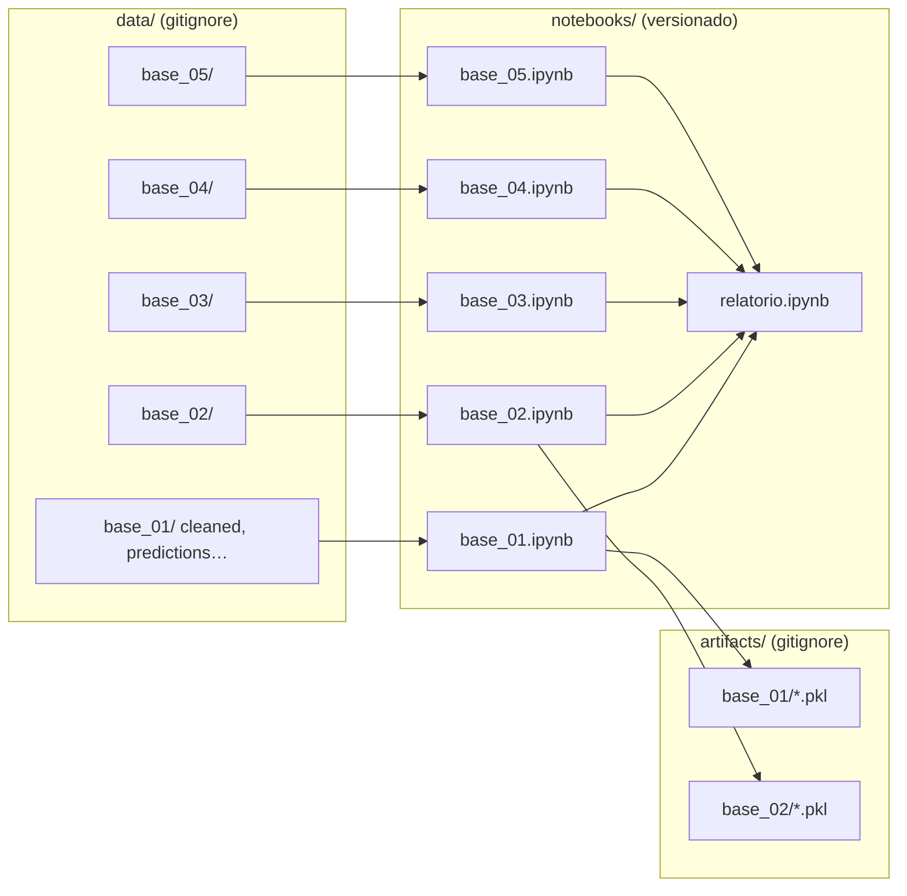

# SDD — Software / Solution Design Document

**Status:** Rascunho  
**Relacionado:** [`PRD.md`](PRD.md) · [`specs/`](specs/) · [ADR-0004](adr/0004-estrutura-repositorio.md)

---

## 1. Visão geral

Análise reprodutível em **Jupyter notebooks**: um notebook por dataset, dados fornecidos ao grupo em `data/` (local, gitignored), relatório final também em notebook.



Cada notebook de base executa o pipeline completo: EDA → STL → features → 4 modelos → walk-forward → MAE → resíduos → feature importance.

## 2. Componentes

| Componente | Onde vive | Spec |
|------------|-----------|------|
| Dados (raw + derivados) | `data/base_XX/` | [`specs/spec-dados.md`](specs/spec-dados.md) |
| Modelos treinados | `artifacts/base_XX/*.pkl` | [ADR-0005](adr/0005-persistencia-artifacts-dados.md) |
| Análise por base | `notebooks/base_XX.ipynb` | specs 02–05 |
| Relatório final | `notebooks/relatorio.ipynb` | [`specs/spec-relatorio.md`](specs/spec-relatorio.md) |
| Contexto / decisões | `context/` | ADRs |

## 3. Estrutura de diretórios

```
series-forecasting/
├── context/                 # Context Engineering
├── docs/
│   └── instrucoes.pdf
├── data/                    # ⚠ GITIGNORE — raw + cleaned_*, predictions_*, mae_*, etc.
│   ├── README.md
│   ├── mae_consolidated.csv
│   └── base_01/ … base_05/
├── artifacts/               # ⚠ GITIGNORE — modelos .pkl por base
│   ├── README.md
│   └── base_01/ … base_05/
├── notebooks/               # Entregas principais (versionado)
│   ├── README.md
│   ├── base_01.ipynb
│   ├── base_02.ipynb
│   ├── base_03.ipynb
│   ├── base_04.ipynb
│   ├── base_05.ipynb
│   └── relatorio.ipynb
└── requirements.txt       # Dependências pinadas (quando criado)
```

## 4. Fluxo de dados

1. Grupo recebe os 5 datasets e coloca cada um em `data/base_XX/`.
2. Notebook carrega raw, salva `cleaned_{base_id}.csv` e demais derivados em `data/base_XX/`.
3. Modelos treinados são salvos em `artifacts/base_XX/{modelo}.pkl`.
4. Previsões, resíduos e métricas vão para `data/base_XX/` com nomenclatura padronizada (ADR-0005).
5. `relatorio.ipynb` lê consolidados (`data/mae_consolidated.csv`, etc.) e exporta HTML/PDF.
6. Zip Odete: notebooks + `data/` + PDF/HTML (+ `artifacts/` se necessário).

## 5. Decisões registradas (ADRs)

| ADR | Assunto |
|-----|---------|
| [0001](adr/0001-metrica-mae-principal.md) | MAE como métrica principal |
| [0002](adr/0002-validacao-walk-forward.md) | Protocolo walk-forward |
| [0003](adr/0003-prevencao-vazamento-dados.md) | Anti-leakage de variáveis externas |
| [0004](adr/0004-estrutura-repositorio.md) | Notebooks + `data/` local |
| [0005](adr/0005-persistencia-artifacts-dados.md) | Pickles e nomenclatura de dados |

## 6. Stack técnica

| Camada | Tecnologia |
|--------|------------|
| Entrega | Jupyter Notebook (`.ipynb`) |
| Linguagem | Python 3.11+ |
| Séries temporais | `statsmodels`, `pmdarima` (SARIMAX) |
| ML | `scikit-learn` + biblioteca do modelo de especialização |
| Relatório | Export HTML/PDF a partir de `relatorio.ipynb` (nbconvert / Quarto) |
| Dados | Arquivos fornecidos ao grupo em `data/base_XX/` |
| Dependências | `requirements.txt` com versões fixas |

## 7. Convenções nos notebooks

```python
# Caminho padrão para carregar dados (executar notebook a partir de notebooks/)
from pathlib import Path

DATA_DIR = Path("../data")
BASE_ID = "base_01"
DATA_PATH = DATA_DIR / BASE_ID

df = pd.read_csv(DATA_PATH / "arquivo.csv")  # ajustar nome do arquivo
```

- Célula inicial: imports, seeds, `BASE_ID`, caminhos.
- Seções markdown espelhando estrutura do relatório (enunciado seção 10.1).
- Funções auxiliares podem ficar no próprio notebook ou em células `%run` compartilhadas — evitar `src/` como entrega.

## 8. Riscos

| Risco | Mitigação |
|-------|-----------|
| `data/` ausente no clone | `data/README.md` + checklist no HANDOFF |
| Caminhos quebrados entre máquinas | Caminhos relativos a partir de `notebooks/` |
| Vazamento temporal | ADR-0003; revisão por notebook |
| Notebooks não reproduzíveis | `requirements.txt`, seeds, ordem de células documentada |
| Divergência entre integrantes | Um notebook por base; context engineering |

## 9. Não implementado ainda

- [ ] Definir número do grupo e modelo de especialização
- [ ] Receber e organizar os 5 datasets em `data/base_XX/`
- [ ] Criar os 6 notebooks (`base_01`–`base_05` + `relatorio`)
- [ ] Fixar horizonte e protocolo walk-forward (ADR-0005 sugerida)
- [ ] Preencher integrantes no PRD
